# Execution Plan

## Project Summary
- **Project Name**: table-order
- **Project Type**: Greenfield
- **Complexity**: Moderate-High (다중 컴포넌트, SSE, MCP Server)

## Detailed Analysis Summary

### Change Impact Assessment
- **User-facing changes**: Yes - 고객용 웹 UI, 관리자용 웹 UI
- **Structural changes**: Yes - 새로운 시스템 아키텍처 설계 필요
- **Data model changes**: Yes - Menu, Order, Table, User 등 새 모델
- **API changes**: Yes - REST API + SSE + MCP Tools
- **NFR impact**: Yes - 성능(SSE 2초), 보안(JWT, bcrypt)

### Risk Assessment
- **Risk Level**: Medium
- **Rollback Complexity**: Easy (Greenfield)
- **Testing Complexity**: Moderate (SSE, MCP 통합 테스트 필요)

---

## Workflow Visualization

```mermaid
flowchart TD
    Start(["User Request"])
    
    subgraph INCEPTION["🔵 INCEPTION PHASE"]
        WD["Workspace Detection<br/><b>COMPLETED</b>"]
        RA["Requirements Analysis<br/><b>COMPLETED</b>"]
        US["User Stories<br/><b>COMPLETED</b>"]
        WP["Workflow Planning<br/><b>IN PROGRESS</b>"]
        AD["Application Design<br/><b>EXECUTE</b>"]
        UG["Units Generation<br/><b>EXECUTE</b>"]
    end
    
    subgraph CONSTRUCTION["🟢 CONSTRUCTION PHASE"]
        FD["Functional Design<br/><b>EXECUTE</b>"]
        NFRA["NFR Requirements<br/><b>EXECUTE</b>"]
        NFRD["NFR Design<br/><b>EXECUTE</b>"]
        ID["Infrastructure Design<br/><b>EXECUTE</b>"]
        CG["Code Generation<br/><b>EXECUTE</b>"]
        BT["Build and Test<br/><b>EXECUTE</b>"]
    end
    
    Start --> WD
    WD --> RA
    RA --> US
    US --> WP
    WP --> AD
    AD --> UG
    UG --> FD
    FD --> NFRA
    NFRA --> NFRD
    NFRD --> ID
    ID --> CG
    CG --> BT
    BT --> End(["Complete"])
    
    style WD fill:#4CAF50,stroke:#1B5E20,stroke-width:3px,color:#fff
    style RA fill:#4CAF50,stroke:#1B5E20,stroke-width:3px,color:#fff
    style US fill:#4CAF50,stroke:#1B5E20,stroke-width:3px,color:#fff
    style WP fill:#FFA726,stroke:#E65100,stroke-width:3px,color:#000
    style AD fill:#FFA726,stroke:#E65100,stroke-width:3px,stroke-dasharray: 5 5,color:#000
    style UG fill:#FFA726,stroke:#E65100,stroke-width:3px,stroke-dasharray: 5 5,color:#000
    style FD fill:#FFA726,stroke:#E65100,stroke-width:3px,stroke-dasharray: 5 5,color:#000
    style NFRA fill:#FFA726,stroke:#E65100,stroke-width:3px,stroke-dasharray: 5 5,color:#000
    style NFRD fill:#FFA726,stroke:#E65100,stroke-width:3px,stroke-dasharray: 5 5,color:#000
    style ID fill:#FFA726,stroke:#E65100,stroke-width:3px,stroke-dasharray: 5 5,color:#000
    style CG fill:#4CAF50,stroke:#1B5E20,stroke-width:3px,color:#fff
    style BT fill:#4CAF50,stroke:#1B5E20,stroke-width:3px,color:#fff
    style INCEPTION fill:#BBDEFB,stroke:#1565C0,stroke-width:3px,color:#000
    style CONSTRUCTION fill:#C8E6C9,stroke:#2E7D32,stroke-width:3px,color:#000
    style Start fill:#CE93D8,stroke:#6A1B9A,stroke-width:3px,color:#000
    style End fill:#CE93D8,stroke:#6A1B9A,stroke-width:3px,color:#000
```

---

## Phases to Execute

### 🔵 INCEPTION PHASE
- [x] Workspace Detection (COMPLETED)
- [x] Requirements Analysis (COMPLETED)
- [x] User Stories (COMPLETED)
- [x] Workflow Planning (IN PROGRESS)
- [ ] Application Design - **EXECUTE**
  - **Rationale**: 새 컴포넌트 설계 필요 (Frontend, Backend, MCP Servers)
- [ ] Units Generation - **EXECUTE**
  - **Rationale**: 다중 유닛 분해 필요 (웹앱, API, MCP)

### 🟢 CONSTRUCTION PHASE (Per-Unit)
- [ ] Functional Design - **EXECUTE**
  - **Rationale**: 새 데이터 모델 및 비즈니스 로직 설계 필요
- [ ] NFR Requirements - **EXECUTE**
  - **Rationale**: 성능(SSE), 보안(JWT) 요구사항 존재
- [ ] NFR Design - **EXECUTE**
  - **Rationale**: NFR 패턴 적용 필요
- [ ] Infrastructure Design - **EXECUTE**
  - **Rationale**: Docker Compose, Docker Image 배포 설계 필요
- [ ] Code Generation - **EXECUTE** (ALWAYS)
  - **Rationale**: 코드 구현 필요
- [ ] Build and Test - **EXECUTE** (ALWAYS)
  - **Rationale**: 빌드 및 테스트 필요

### 🟡 OPERATIONS PHASE
- [ ] Operations - PLACEHOLDER

---

## Proposed Units of Work

| Unit | Description | Priority |
|------|-------------|----------|
| **Unit 1: Backend API** | FastAPI 서버, DB 모델, REST API, SSE | High |
| **Unit 2: Customer Frontend** | React 고객용 웹 UI | High |
| **Unit 3: Admin Frontend** | React 관리자용 웹 UI | Medium |
| **Unit 4: Customer MCP Server** | 고객용 Chatbot MCP Tools | Low |
| **Unit 5: Admin MCP Server** | 관리자용 Chatbot MCP Tools | Low |
| **Unit 6: Infrastructure** | Docker Compose, Dockerfile | Medium |

---

## Estimated Timeline
- **Total Stages**: 10 (INCEPTION 4 + CONSTRUCTION 6)
- **Units**: 6

## Success Criteria
- **Primary Goal**: 테이블오더 MVP 완성
- **Key Deliverables**:
  - 고객용 반응형 웹 UI
  - 관리자용 웹 UI
  - FastAPI 백엔드 서버
  - PostgreSQL 데이터베이스
  - SSE 실시간 통신
  - 고객용/관리자용 MCP Server
  - Docker 배포 환경
